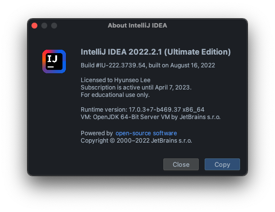
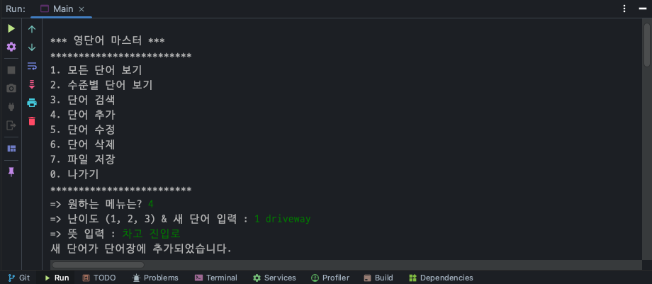
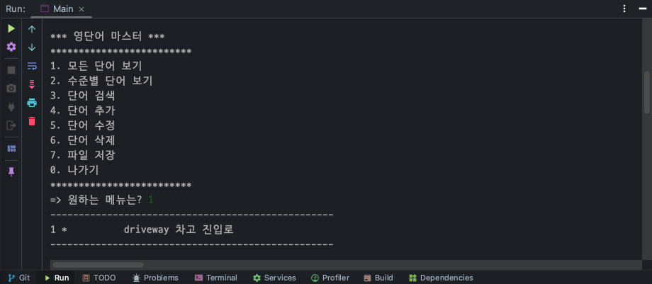
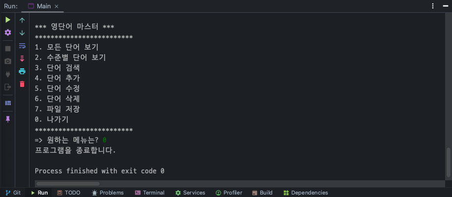

# 🧑‍💻 Project1. WordMaster

> 실전프로젝트1 01분반

22100600 이현서

22-2 실전프로젝트1 수업의 Project 진행을 위한 💾 코드 저장소 입니다.

---

## 프로젝트 개발 환경

* 💻 OS
    * macOS 12.5.1 (21G83)
* ☕️ JDK
    * 17.0.3+8
* 🔨 Project Management
    * Maven
* 📝 IDE
    * Intellij IDEA 2022.2.1 (Ultimate Edition)

---

## 🏷 Project Log

### Step1. Create & Read

#### 구현 내용 체크리스트

* Create (4. 단어 추가) 기능
    * ✅ **정상 작동**
    * 실행 화면:

* Read (1. 모든 단어보기) 기능
    * ✅ **정상 작동**
    * 실행 화면:

* 종료 기능
    * ✅ **정상 작동**
    * 실행 화면:

#### 중간 평가

**소감**

`OOP 개념에 대한 효과적인 실습이 되었습니다.`

**어려움**

`매번 활용하던 Visual Studio Code 대신, IntelliJ IDEA를 활용하니 필요한 기능을 찾기 힘들었습니다.`

**건의사항**

`CRUD 프로그램의 메인 화면 (메뉴 리스트) 구성요소는 따로 .txt의 형태로 공유해 주시면 좋겠습니다. PDF의 경우, 메뉴 구성을 복사하는데에 불편함이 있습니다!`

---